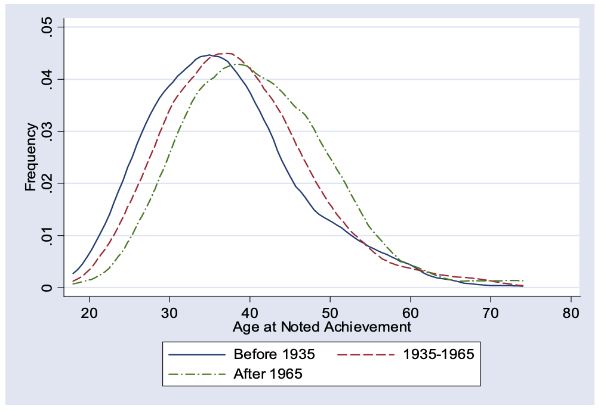

# Do ideas get harder to find?
{: .no_toc }

1. TOC 
{:toc}

When discussing the dynamics of R&D, one of the findings was that $\phi<1$, which given this formula for the growth rate of productivity

$$
g_{A} = \theta \frac{R_{t}^{\lambda}}{A_t^{1-\phi}}
$$

meant that the growth rate of productivity *falls* as productivity gets higher (holding R constant). The justification for this was that it fit the data, as we don't see the growth rate of productivity accelerating over time (which it would if $\phi>1$). Is there other evidence?

## The age of genius
Economist [Ben Jones](https://www.kellogg.northwestern.edu/faculty/jones-ben/htm/Research.htm) has done a lot of research on how science has gotten harder over time, in the sense that today scientists tend to be much older when they produce ideas that are Nobel-prize-worthy or of similar caliber. 

This figure is from a paper on [Age and Great Invention](https://ideas.repec.org/a/tpr/restat/v92y2010i1p1-14.html). It plots the distribution of ages of Nobel winners and "great inventors" (defined in the papge) from three different time periods. This is very important, this plots their age *when they came up with their big idea*. The change in distribution isn't just because it took longer to recognize greatness.

The peak of these three curves shifted rightward about 6 years from pre-1935 to the post-1965 period. The interpretation we can give to this figure is that it took longer to build up the skills or knowledge to take the next great leap forward. Einstein was a genius, yes. But in some sense he had it easier than current physicists, because the current physicists have to learn everything *he* learned first, and *then* they can start trying to come up with new ideas. 

This data is consistent with the idea that $\phi<1$ and higher productivity (assuming it is correlated with more advanced science) makes further improvements in productivity harder.

## Research effort and pace of innovations
A more direct study of this is from [Bloom, Jones, Van Reenen, and Webb](https://web.stanford.edu/~chadj/IdeaPF.pdf). They start with our basic equation for productivity growth and assume $\lambda = 1$ (which isn't crucial for what they do). They then re-arrange this to be

$$
\frac{g_{A}}{R_t} = \theta \frac{1}{A_t^{1-\phi}}.
$$

The thing on the left is measurable as the growth rate of productivity divided by the number of researchers. They call this left-hand side term "research productivity", as it captures how much growth in productivity you get per researcher. What they then do is measure this research productivity term for different industries and technologies. If that research productivity falls over time, this is consistent with a value of $\phi<1$. 

Start with semiconductors as an example. Semiconductors seems to obey something called "Moore's Law" (after Gordon Moore) who observed that the number of transistors on each semiconductor was doubling every two years. That essentially amounts to a doubling of semiconductor productivity every two years, which is a growth rate of 35%. This 35% growth rate has been remarkably consistent for the last forty years. 

What does that tell us about $\phi$? Well, if we were using the same number of $R_t$ each year developing new semiconductors, then this would indicate that research productivity was constant, and this would imply that $\phi=1$. Instead, what the authors show is that $R_t$ was going up dramatically over these forty years, implying that $\phi<1$. 

The figure shows how $g_A$ stayed the same, while $R_t$ went up, in semiconductors. As $A_t$ was rising due to the extra transistors, it must be that $\phi<1$. We can actually work out the value of $\phi$ for semiconductors. 

First, the growth rate of research productivity, $g_{gA/R}$, is

$$
g_{gA/R} = -(1-\phi)g_A
$$

and the authors report that the growth rate of research productivity is -7%. And we know Moore's law says $g_A$ is 35%, so we've got

$$
-.07 = -(1-\phi).035
$$

which solves to $\phi=0.8$. Less than one, as we suspected. 

The authors do this kind of calculation for all sorts of different technologies. They find over and over again that $\phi<1$. Moore's Law actually is the least pessimistic outcome. For most industries, they find values of $\phi$ like -2 and -3. For the economy as a whole, research productivity grew at -4%, and produtivity growth was about 1.5%, so they get

$$
-.04 = -(1-\phi).015
$$

or $\phi = -1.67$. Meaning it does get harder to find each new idea every year. A lot harder. But note that we already know from the dynamics of productivity growth that this doesn't mean productivity growth *falls*. It just means that productivity growth stays *stable*.

## Singularity
If $\phi\geq1$, then what this implies in our formula for productivity growth is that as productivity goes up, the *growth rate* of productivity would go up as well. There would be an accelerating relationship. It doesn't seem to be true *so far*, but perhaps it might be true in the future?

Some people speculate that in fact faster computers (perhaps AI) may be able to essentially shift $\phi>1$ and create explosive growth in technology so that $g_A$ itself may explode towards infinity. You might call this "the singularity". 

<iframe width="560" height="315" src="https://www.youtube.com/embed/1uIzS1uCOcE" frameborder="0" allow="accelerometer; autoplay; encrypted-media; gyroscope; picture-in-picture" allowfullscreen></iframe>
